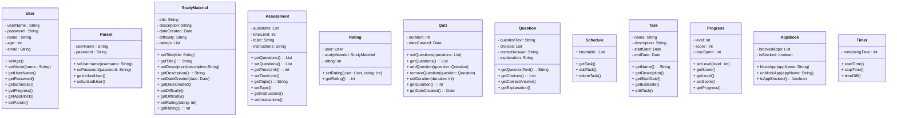

```mermaid
classDiagram

class User{

    - userName : String
    - password : String
    - name : String
    - age : int
    - email : String
    + setAge( )
    + setName(name : String)
    + getUserName()
    + getPassword()
    + getSchedule()
    + getProgress()
    + getAppBlock()
    + setParent()

}


class Parent{

    - userName : String
    - password : String
    + seUsername(username: String)
    + sePassword(password: String)
    + getLinkedUser()
    + setLinkedUser()

}

class StudyMaterial{

    - title: String
    - description: String
    - dateCreated: Date
    - difficulty: String
    - ratings: List<Rating>
    + setTitle(title: String)
    + getTitle(): String
    + setDescription(description:String)
    + getDescription(): String
    + setDateCreated(date: Date)
    + getDateCreated()
    + setDifficulty()
    + getDifficulty()
    + setRating(rating: int)
    + getRating(): int

}

class Assessment{

    - questions: List<Question>
    - timeLimit: int
    - topic: String
    - instructions: String
    + getQuestions(): List<Question>
    + setQuestions(): List<Question>
    + getTimeLimit(): int
    + setTimeLimit()
    + getTopic(): String
    + setTopic()
    + getInstructions()
    + setInstructions()

}

class Rating{

    - user: User
    - studyMaterial: StudyMaterial
    - rating: int
    + setRating(user: User, rating: int)
    + getRating(): int

}

class Quiz {

    - duration: int
    - dateCreated: Date
    + setQuestions(questions: List<Question>)
    + getQuestions(): List<Question>
    + addQuestion(question: Question)
    + removeQuestion(question: Question)
    + setDuration(duration: int)
    + getDuration(): int
    + getDateCreated(): Date

}

class Question{

    - questionText: String
    - choices: List<String>
    - correctAnswer: String
    - explanation: String
    + getQuestionText(): String
    + getChoices(): List<String>
    + getCorrectAnswer()
    + getExplanation()
}

class Schedule{

    + timetable : List<Task>
    + getTask()
    + addTask()
    + deleteTask()

}

class Task{

    - name: String
    - description: String
    - startDate: Date
    - endDate: Date
    + getName(): String
    + getDescription()
    + getStartDate()
    + getEndDate()
    + editTask()
}

class Progress{

    - level: int
    - score : int
    - timeSpent : int
    + setLevel(level : int)
    + getScore()
    + getLevel()
    + setScore()
    + getProgress()

}

class AppBlock{

    - blockedApps: List<String>
    - isBlocked: boolean
    + blockApp(appName: String)
    + unblockApp(appName: String)
    + isAppBlocked(): boolean

}

class Timer{

    - remainingTime : int
    + startTime()
    + stopTime()
    + timeDiff()
}
```
