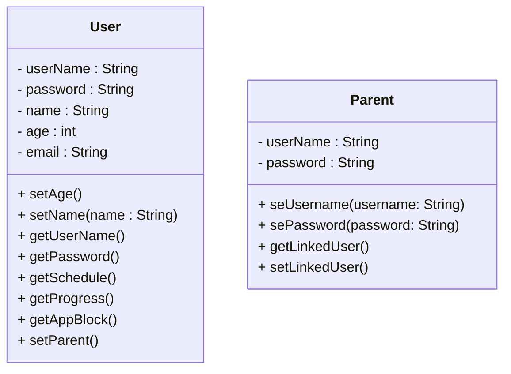

```mermaid

classDiagram

class User{
    - userName : String
    - password : String
    - name : String
    - age : int
    - email : String
    + setAge( )
    + setName(name : String)
    + getUserName()
    + getPassword()
    + getSchedule()
    + getProgress()
    + getAppBlock()
    + setParent()

}


class Parent{
    - userName : String
    - password : String
    + seUsername(username: String)
    + sePassword(password: String)
    + getLinkedUser()
    + setLinkedUser()

}

```
